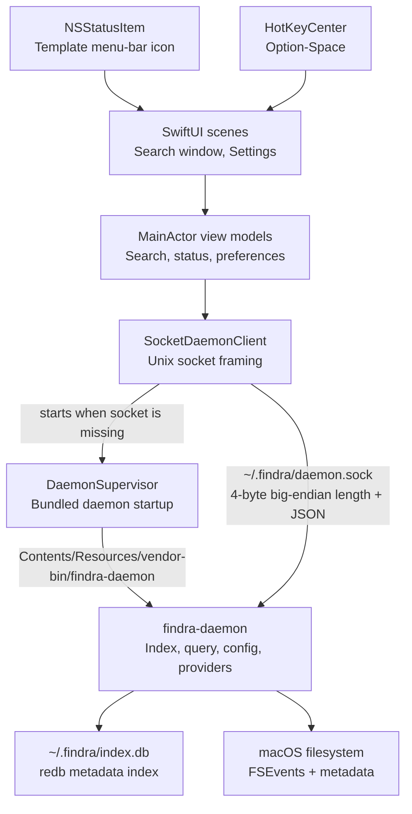

# Findra macOS App Architecture

Findra for macOS is a native SwiftUI app around the shared `findra-daemon`. The app is responsible for macOS presentation, preferences, packaging, hotkeys, and daemon supervision. The daemon remains responsible for indexing, query execution, watched paths, persistence, and protocol versioning.

## System Boundary



## Runtime Flow

1. `FindraApp` creates one `AppModel` and a single `Window` scene for the search window.
2. `StatusItemController` installs a low-contrast template menu-bar icon. Clicking it activates or focuses the existing search window instead of creating duplicates.
3. `HotKeyCenter` registers the native Option-Space shortcut and uses the same single-window focus path.
4. Closing the search window hides the Dock icon and leaves the menu-bar item active; opening from the menu bar or hotkey restores the regular app window.
5. `SearchViewModel` subscribes to daemon status updates, reads daemon config, sends paged search requests, applies daemon-backed file type filters where supported, and caches app-side owner metadata for visible rows.
6. `SocketDaemonClient` opens the local Unix socket, sends framed JSON requests, and decodes framed responses.
7. `DaemonSupervisor` starts the bundled daemon when the socket is missing.
8. SwiftUI views render local state only. They do not know socket framing or daemon startup rules.

## IPC Contract

The app mirrors the daemon request and response shapes in `DaemonProtocol.swift`.

- Normal requests receive one response.
- `SubscribeStatus` keeps the socket open and streams status frames when indexed count, index database size, or watched path state changes.
- `IndexStats.protocol_version` is checked for compatibility.
- App and daemon product versions are displayed to users; protocol details are only surfaced when incompatible.

Breaking protocol changes belong in `findra-protocol` and the daemon first. The app should not work around missing protocol capabilities with divergent local state unless the state is explicitly UI-only.

## Module Responsibilities

| Path | Responsibility |
|---|---|
| `Sources/FindraApp/FindraApp.swift` | App scenes, single-window activation, top-level object graph |
| `Sources/FindraApp/SearchView.swift` | Main search UI, filters, results table, status bar |
| `Sources/FindraApp/SearchViewModel.swift` | Main-actor search state, status stream, sorting, owner cache, actions |
| `Sources/FindraApp/PreferencesView.swift` | Settings surface |
| `Sources/FindraApp/DaemonProtocol.swift` | Swift `Codable` mirror of daemon IPC shapes |
| `Sources/FindraApp/DaemonClient.swift` | Unix-socket transport and request retry |
| `Sources/FindraApp/DaemonSupervisor.swift` | Bundled daemon discovery and startup |
| `Sources/FindraApp/StatusItemController.swift` | Menu-bar launcher icon |
| `Sources/FindraApp/HotKeyCenter.swift` | Native global hotkey registration |
| `Resources/Findra.icns` | Dock, Finder, and bundle icon |
| `scripts/package-local.sh` | Local `.app` bundle, ad-hoc signing, archive, and checksum |

## Data Boundary

The app does not persist an index and does not keep a second search database. It receives result pages and status snapshots from the daemon and holds only transient UI state.

App-local state is limited to presentation and preferences:

- current query and filters
- current selected row/path
- ignored permission warnings
- visible-row owner cache
- window/menu-bar/hotkey state

The daemon-owned state includes:

- indexed paths
- excluded paths
- file metadata index
- index database path and size
- watched path health
- daemon and protocol versions

## UI Model

The main window follows an Everything-style dense table:

- left sidebar for file type filters, indexed paths, and excluded paths
- search field and search options
- aligned result columns with header sorting
- bottom status bar for result count, index database, and daemon health

Indexed and excluded path changes go through the daemon config API. Excluded paths are applied during daemon scanning, live event handling, and search, so hidden directories do not remain in the local index.

Table sorting is local-first for responsiveness. Background daemon refreshes are generation-guarded so stale responses cannot overwrite newer UI state.

## Daemon Lifecycle

The app bundles `findra-daemon` at:

```text
Findra.app/Contents/Resources/vendor-bin/findra-daemon
```

When the socket is missing, the app starts the bundled daemon. The daemon is not installed as a separate LaunchAgent by the app. Quitting the app does not explicitly stop the daemon because CLI and app users may share the same socket and index.

## Icon Policy

- Dock, Finder, and `/Applications` use the bundle icon from `Resources/Findra.icns`.
- The menu bar uses a template icon drawn at runtime so macOS can tint it consistently with surrounding system status icons.
- The app must not override `NSApplication.shared.applicationIconImage` at runtime; doing so makes the Dock icon diverge from Finder and `/Applications`.

## Release and Packaging

Local packaging builds the Swift app, embeds the daemon from the sibling `findra` repository, ad-hoc signs the bundle, and emits `.dmg`, `.zip`, and `.sha256` files. Public distribution is through GitHub Releases. Developer ID signing and notarization remain release-hardening work when credentials are available.
