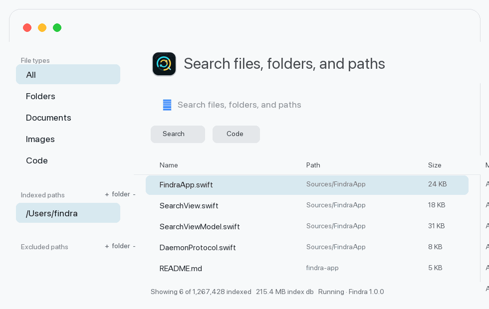

<p align="center">
  
</p>

# Findra for macOS

Findra is the native macOS desktop app for the `findra` file search daemon. It gives the same indexed, daemon-backed search used by the CLI a Mac-first interface: a main search window, menu-bar launcher, preferences, compatibility checks, bundled daemon startup, and direct access to the local daemon.



## Download

Download Findra 1.1.0 from the GitHub Release:

- [Findra-1.1.0-macos-arm64.dmg](https://github.com/MOXHTech/findra-app/releases/download/1.1.0/Findra-1.1.0-macos-arm64.dmg): recommended installer image for Apple Silicon Macs.
- [Findra-1.1.0-macos-arm64.zip](https://github.com/MOXHTech/findra-app/releases/download/1.1.0/Findra-1.1.0-macos-arm64.zip): archive fallback.
- `.sha256` files are published beside each asset for checksum verification.

## Capabilities

- Native SwiftUI macOS app, designed for the current macOS platform direction.
- Bundles `findra-daemon` inside the app and starts it automatically when `~/.findra/daemon.sock` is missing.
- Talks to the daemon over the local Unix domain socket at `~/.findra/daemon.sock`.
- Uses the versioned daemon IPC contract instead of embedding the search engine.
- Search-as-you-type with indexed file, folder, path, size, and modified-time results.
- Indexed and excluded paths can be added by typing a path directly or choosing one from a native file picker.
- Configurable excluded paths are sent to the daemon, reducing both indexed data and visible search results.
- Search results are loaded in daemon-backed pages, so the file list can scroll through large indexes without one oversized response.
- Menu-bar launcher icon that opens the main Findra window.
- Visible app and daemon versions in the main window.
- Shared index with the CLI, so installing both does not create duplicate indexes.

## Requirements

- macOS 27 target experience.
- Xcode 26.6 or newer toolchain for local development.
- The local `findra` repository next to this repository when building packages from source.

## Run

Run the app:

```bash
swift run Findra
```

In development, the app can auto-start `../findra/target/release/findra-daemon` or `../findra/target/debug/findra-daemon` if one has already been built. Installed `.app` bundles include `Contents/Resources/vendor-bin/findra-daemon`, so users do not need to start a separate service manually.

## Development

```bash
swift build
swift test
```

There are no external Swift package dependencies. The app uses SwiftUI, Foundation, AppKit, and Darwin socket APIs from the platform SDK.

Build a local `.app` bundle:

```bash
./scripts/package-local.sh
```

By default the package script builds and embeds `../findra/crates/findra-daemon`. Use `FINDRA_REPO=/path/to/findra` if the daemon repository is elsewhere.

Install the local build into `/Applications`:

```bash
./scripts/install-local.sh
```

Remove a local install:

```bash
./scripts/uninstall-local.sh
```

## Download Distribution

Findra is distributed as an open-source macOS app through GitHub Releases, not the Mac App Store. Release assets include:

- `.dmg`: recommended download for most users, with the daemon included inside `Findra.app`.
- `.zip`: fallback download for users who prefer archives.
- `.sha256`: checksum files for verifying downloads.

The local build is ad-hoc signed for development testing. Public downloads can run without Mac App Store distribution; Developer ID signing and notarization are still recommended before broad release to reduce Gatekeeper friction.

## License

Findra for macOS is licensed under GPL-3.0-or-later. See [LICENSE](LICENSE).

## Performance Checks

Performance belongs mostly to the daemon and index engine. For the app, verify:

- Warm search requests return without blocking the window.
- Typing stays responsive while requests debounce.
- Result rendering remains smooth at the default 1,000-row cap.
- Daemon status refresh does not interrupt search input.
- Cold daemon startup can still take longer on multi-million-file indexes while the daemon loads the persisted index.

Use the daemon-side benchmark commands in the `findra` repository for index and query throughput.

## Troubleshooting

- `findra daemon is not running`: confirm the installed app contains `Contents/Resources/vendor-bin/findra-daemon`; development builds can also set `FINDRA_DAEMON_BIN=/path/to/findra-daemon`.
- Compatibility warning: upgrade either the daemon or app so both use the same IPC contract.
- Empty results with no error: confirm the daemon has indexed at least one watched path.
